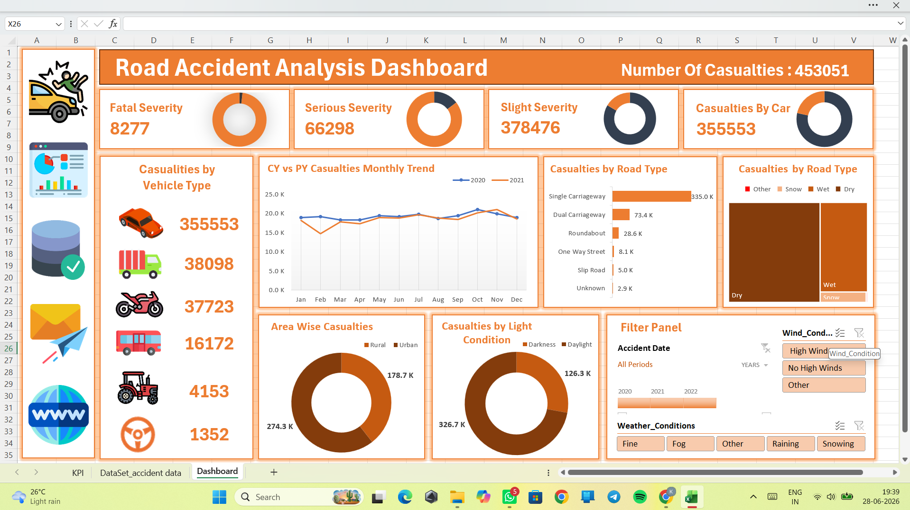

# 🚗 Road Accident Analysis Dashboard

An interactive Road Accident Analysis Dashboard built using Microsoft Excel to analyze accident trends, casualty severity, vehicle involvement, road conditions, and environmental factors. The dashboard provides meaningful insights to support data-driven decision-making and improve road safety strategies.

---

## 📌 Project Overview

This project focuses on analyzing road accident data and presenting key insights through an interactive dashboard. Users can filter and explore accident patterns based on multiple factors such as vehicle type, road type, weather conditions, and accident severity.

---

## 📊 Dashboard Features

### ✅ Key Performance Indicators (KPIs)
- Total Casualties: **453,051**
- Fatal Casualties: **8,277**
- Serious Casualties: **66,298**
- Slight Casualties: **378,476**
- Casualties by Car: **355,553**

### ✅ Analysis Included
- Casualties by Vehicle Type
- Monthly Casualty Trends (CY vs PY)
- Casualties by Road Type
- Area-wise Casualties (Urban vs Rural)
- Casualties by Light Condition
- Interactive Filters using Slicers

---

## 🛠️ Tools & Technologies Used

- Microsoft Excel
- Pivot Tables
- Pivot Charts
- Slicers
- Conditional Formatting
- Data Cleaning and Transformation
- Dashboard Design

---

## 📈 Key Insights

- Slight severity accidents account for the majority of casualties.
- Cars are involved in most road accidents.
- Single carriageway roads have the highest number of casualties.
- Urban areas experience more accidents than rural areas.
- Daylight conditions report more casualties than darkness.

---

## 📂 Project Structure

```text
Road-Accident-Analysis-Dashboard
│
├── Dashboard.xlsx
├── Dataset_Accident_Data.xlsx
├── README.md
└── Screenshot.png
```

---

## 🚀 How to Use

1. Clone the repository:

```bash
git clone https://github.com/kirankawale4287-hue/Road-Accident-Analysis.git
```

2. Open the Excel dashboard file.
3. Use the slicers to filter the data.
4. Analyze trends and derive insights.

---

## 📸 Dashboard Preview

```markdown

```

---

## 🎯 Business Impact

This dashboard helps:
- Government agencies monitor road safety.
- Traffic departments identify accident-prone conditions.
- Policymakers create preventive measures.
- Data analysts perform trend analysis efficiently.

---

## 👨‍💻 Author

**Kiran Kawale**

---

⭐ If you like this project, don't forget to give it a star!
